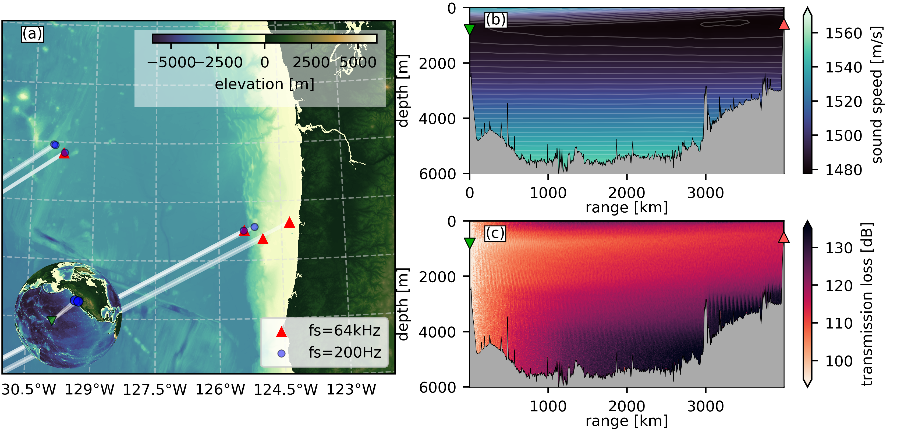
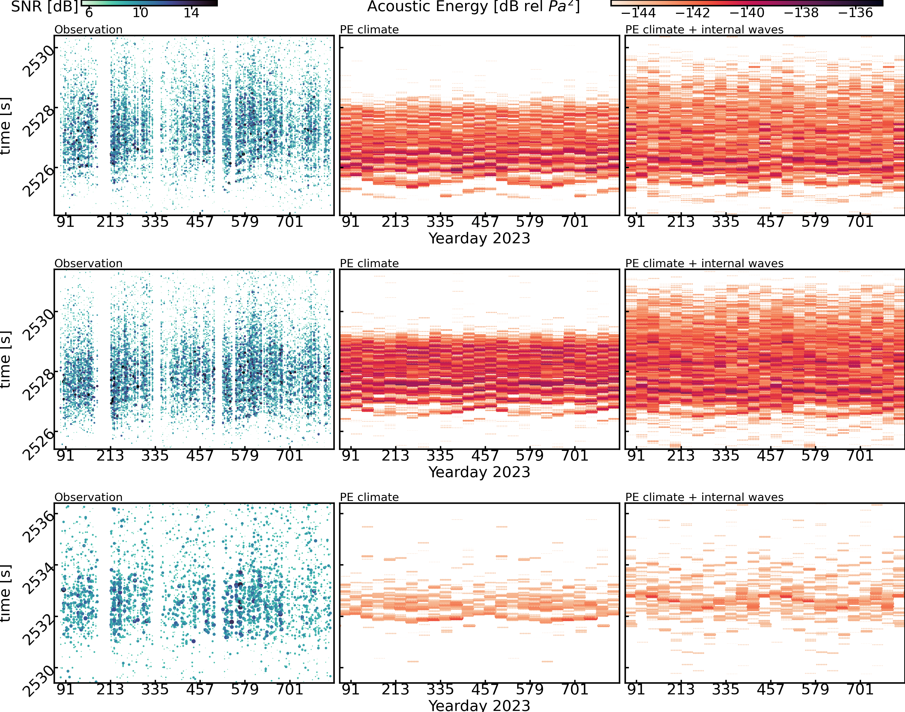

# Kauai Beacon to OOI
Code used to run analysis and simulation in support of 
Ragland et. al. 2025 Receptions of Kauai Beacon transmissions by Ocean Observatories Initiative Hydrophones

<figure style="width: 450px; margin: 0 auto;">
  
  <figcaption style="width: 100%; font-style: italic; text-align: left;">
    <em>Figure 1. (a) Kauai Beacon and OOI hydrophones (b) sound speed from KB to Oregon Offshore (c) median transmission loss from KB to Oregon Offshore</em>
  </figcaption>
</figure>
<br><br>
<figure style="width: 450px; margin: 0 auto;">
  
  <figcaption style="width: 100%; font-style: italic; text-align: left;">
    <em>Figure 5. Simulated and measured arrival envelope statistics for different hydrophone locations. (a) Central Caldera (b) Eastern Caldera (c) Axial-Base bottom-mounted (d) Oregon Offshore (e) Oregon Slope Base 200m (f) Axial Base 200m. The red lines represent the mean and standard deviation (shaded) of a month of the measured complex envelope of the acoustic arrivals. The black lines represent the mean and standard deviation (shaded) of 50 different acoustic arrival envelopes for 50 different realizations of internal wave perturbations.</em>
  </figcaption>
</figure>

## Code Stack
Required dependancies

versions listed were successfully used to run the code, other versions may work but are untested.
Some packages / functions are private on GitHub, if interested please reach out.


## Setup
**setup python dependancies**
All python packages that were in part written for this work are listed below. Versions listed were successfully used to run the code, other versions may work but are untested. Some packages / functions are private on GitHub, if interested please reach out.

| Package    | Source   | url   | version   |
| - | - | - | - | 
| ooipy | pypi | https://pypi.org/project/ooipy/  | 1.2.3 |
| xrsignal | pypi | https://pypi.org/project/xrsignal | 0.0.2 |
| kaooi | GitHub | https://github.com/John-Ragland/kaooi | 0.0.3 |
| envy | GitHub | https://github.com/John-Ragland/envy | 0.0.2 |
| BigHorn | GitHub | https://github.com/John-Ragland/BigHorn | 0.0.1 |

All packages can be installed with pip, (although some are not posted to pypi). To install packages that are not posted to pypi, you can install it with a local copy of the source code. An example of this is below

```bash
git clone https://github.com/John-Ragland/kaooi
cd kaooi
pip install -e .
```

Also, the dependancies listed in the `pyproject.toml` of these package may not actually correctly build the dependancies needed to run the code. I've run into a good bit of versioning errors, especially with migrating to python 3.12 and numpy 2.x. So as reference, I've also included a yaml file `kb.yaml`, which gives the version of every package that I used to successfully run this code. (And also a bunch of other packages that were not needed). Building a conda environment directly from this yaml won't work though, since some of the above packages are not published on pypi.

**setup dotenv**
this package uses python-dotenv to manage local directories.
- Create a file named `.env` in the home directory of this repository. An template `.env.example` is provided

**matlab dependancies**
add matlab dependancy for numerically simulation internal wave realizations.
- `iwGMtfast.m` should be added to directory `simulation/internal_waves/`. If you would like this function, please reach out.

## Analysis
First, you need to download ooi data when the kauai beacon is transmitting. The scripts the build and open the KBOOI dataset are in the `kaooi` package. After installing the kaooi package, and setting up the .env file (using the .env.example), you can run the following scripts to download the broadband and low frequency OOI data. SLURM job scripts are include, but if you want to use these, you'll need to edit the .job files to match your specific HPC environment. The directories to the scripts are relative to the kaooi reposititory.

For data through March of 2025, the dataset is approximately 498 GB

**download broadband data**
```bash
sbatch scripts/download/SLURM_jobs/download_bb.job
```
alternatively, just running the python script:
```bash
python scripts/download/download_64kHz/py
```

**download low-frequency data**
```bash
sbatch scripts/download/SLURM_jobs/download_lf.job
```
alternatively, just running the python script:
```bash
python scripts/download/download_200Hz/py
```

### computing receptions
To compute a single, match filtered, stacked reception for each KB transmission and save the results to disk the python script below can be used.

```bash
python analysis/compute_receptions.py
```

## Simulation
### simulate realizations of internal wave perturbations
the difference in latitude along all paths to OOI hydrophones is assumed to be neglible and the same internal wave realizations are used for all OOI tracks.
The specific geodesic between KB and LJ01A (Oregon Shelf) is used because it is the longest track.

- get climate sound speed slices
    ```bash
    python simulation/internal_waves/get_100km_ocean_sections.py
    ```
- calculate dciw perturbations
    ```bash
    sbatch simulation/internal_waves/job_script.job
    ```
    - script to map this calculation using SLURM hpc is provided, specific aspects (like partition name) will need to be edited for specific HPC
    - you can also just loop through KB2OOI_real_func(idx) in matlab for `idx = 1:50;`
    - this script creates 442GB of data, but once the realization netcdf files are created in the next script, the mat files can be deleted.
- combine the 100km sections with a cosine squared taper
    ```bash
    python simulation/internal_waves/merge_dciw.py
    ```

### simulate times fronts with climate sound speeds
simulate the time-fronts using PE and WOA climate sound speeds. Time fronts are simulated with and without internal wave perturbations. If you are using a virtual environment for python package management, make sure that this is active before running the script.
```bash
sbatch simulation/pe_simulation/time_fronts.job
```
alternative, you can just run the python script
```bash
python simulation/pe_simulation/time_fronts.py
```

### monthly arrival structure (with and without internal waves)
simulate the timefront for 12 months for all hydrophone locations using WOA monthly climate profiles, and internal wave realizations computed above. This is computed using a slurm array inside of `monthly_arrivals.job`. Individual aspects of the sbatch file will need to be changed for your specific SLURM setup. If you are using a virtual environment for python package management, make sure that this is active before running the script.
```bash
sbatch simulation/pe_simulation/monthly_arrivals.job
```
alternatively, you can run the python script for any node / month combination
``` bash
python simulation/pe_simulation/monthly_arrivals.py --node "LJ01C" --month 6
```

### Monte Carlo internal wave simulation
run PE for every OOI locatation using the climate WOA sound speed profile and 50 independant realizations of Garett-Munk internal waves. The script `monte_carlo_task_manager.py` is a fairly complicated task management script that updates job calls using SLURM and allocates a specified number of number to two different partitions. To run this, you will need to edit the SLURM batch scripts in lines 59-84 to match your specific HPC configuration. You do need to run it from this directory for the local paths to work.

```bash
python simulation/monte_carlo_iws/monte_carlo_task_manager.py
```

The script `run_PE_monte_carlo.py` is the script that the task manager maps. You can run this for a specified node and realization id with:
```bash
python simulation/monte_carlo_iws/run_PE_monte_carlo.py AXCC1 </path/to/dciw_001.nc>
```
where <path/to/dciw_001.nc> is replaced with `<dataset_dir>iws/realizations/dciw_001.nc`

## Publication Figures
The python notebooks used to genereate the publication figures are provided in the directory `publication_figures/`